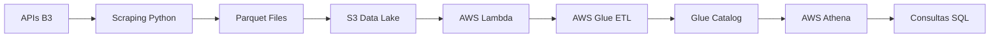

# 🚀 Pipeline Batch Bovespa - AWS

## 📜 Sobre o Projeto
Este projeto implementa um **pipeline de dados batch** completo para ingestão, processamento e análise dos dados do pregão da **B3 (Bolsa de Valores de São Paulo)**, utilizando serviços da **AWS**.

O pipeline executa as seguintes etapas:
1. **Scraping** automatizado dos dados da B3 via API
2. **Transformação** para formato Parquet otimizado
3. **Armazenamento** no S3 com particionamento por data
4. **Orquestração** via AWS Lambda
5. **Processamento ETL** com AWS Glue
6. **Consultas analíticas** via AWS Athena

**Status Atual:** 🎉 **Pipeline 100% Funcional** - Fases 1-3 concluídas com sucesso

---

## 🏗️ Estrutura do Projeto

```
bovespa-aws-pipeline/
├── 📁 .env                          # Configurações AWS (não versionado)
├── 📁 .env.template                 # Template de configuração
├── 📁 backup_reset/                 # Backup dos componentes funcionais
├── 📁 config/                       # Configurações YAML
│   ├── app_config.yml               # Configurações da aplicação
│   └── aws_config.yml               # Configurações AWS
├── 📁 data/                         # Dados locais e processados
│   └── 📁 processed/                # Arquivos Parquet processados
├── 📁 data_lake/                    # Estrutura local do data lake
├── 📁 docs/                         # Documentação do projeto
│   ├── arquitetura_aws.md           # Documentação da arquitetura
│   ├── kanban_de_progresso.md       # Status das tarefas
│   ├── log_de_tarefas.md           # Log detalhado de atividades
│   └── diagrama_arquitetura.drawio  # Diagrama da solução
├── 📁 infrastructure/               # Infraestrutura como código
│   ├── 📁 cloudformation/           # Templates CloudFormation
│   │   ├── main.yml                 # Stack principal
│   │   └── README.md                # Guia de deploy
│   └── 📁 scripts/                  # Scripts de deploy
│       └── deploy.sh                # Script de deployment
├── 📁 src/                          # Código fonte principal
│   ├── 📁 athena/                   # Consultas e views Athena
│   │   ├── 📁 queries/              # Consultas analíticas
│   │   │   ├── sector_analysis.sql   # Análise por setor
│   │   │   ├── temporal_analysis.sql # Análise temporal
│   │   │   └── top_stocks.sql        # Top ações
│   │   └── 📁 views/                # Views materializadas
│   │       ├── sector_summary.sql    # Resumo por setor
│   │       └── stock_ranking.sql     # Ranking de ações
│   ├── 📁 glue/                     # Jobs ETL Glue
│   │   ├── etl_job.py               # Job principal de ETL
│   │   └── transformations.py       # Transformações de dados
│   ├── 📁 lambda/                   # Funções Lambda
│   │   ├── requirements.txt         # Dependências Lambda
│   │   └── trigger_scraping.py      # Function principal
│   └── 📁 scraping/                 # Módulo de coleta de dados
│       ├── __init__.py              # Inicialização do módulo
│       ├── config.py                # Configurações e URLs da B3
│       ├── data_config.py           # Config de estrutura de dados
│       ├── parquet_processor.py     # Processador Parquet
│       ├── scraping.py              # Engine principal de scraping
│       └── utils.py                 # Funções auxiliares
├── 📁 tests/                        # Testes automatizados
│   ├── __init__.py                  # Inicialização dos testes
│   ├── test_etl.py                  # Testes do ETL Glue
│   ├── test_lambda.py               # Testes da Lambda
│   ├── test_s3_pipeline.py          # Testes do pipeline S3
│   └── test_scraping.py             # Testes do scraping
├── test_pipeline_reset.py           # Script de teste completo
├── pyproject.toml                   # Configuração do projeto Python
├── pytest.ini                      # Configuração do pytest
├── requirements.txt                 # Dependências Python
└── README.md                       # Este arquivo
```

---

## 🛠 Tecnologias e Ferramentas

### **Backend & Data Processing**
- **Python 3.9+** - Linguagem principal
- **Pandas 2.0+** - Manipulação de dados
- **PyArrow 12.0+** - Processamento Parquet
- **Requests** - Cliente HTTP para APIs B3

### **AWS Cloud Services**
- **S3** - Data Lake (bucket: `bovespa-pipeline-data-adri-victor`)
- **Lambda** - Orquestração e trigger do pipeline
- **Glue** - ETL visual e catálogo de dados
- **Athena** - Engine de consultas SQL
- **CloudFormation** - Infraestrutura como código

### **Desenvolvimento & Testes**
- **pytest** - Framework de testes (34/35 testes passando)
- **python-dotenv** - Gerenciamento de variáveis de ambiente
- **Git** - Controle de versão

---

## 🚀 Como Executar o Projeto

### **Pré-requisitos**

1. **Python 3.9+ instalado**
2. **Conta AWS ativa** com permissões para S3, Lambda, Glue e Athena
3. **AWS CLI configurado** (opcional, mas recomendado)
4. **Git** para clonar o repositório

### **1. Setup Inicial**

```bash
# 1. Clone o repositório
git clone https://github.com/goth-coder/bovespa-aws-pipeline.git
cd bovespa-aws-pipeline

# 2. Crie um ambiente virtual Python
python -m venv .venv

# 3. Ative o ambiente virtual
# No macOS/Linux:
source .venv/bin/activate
# No Windows:
# .venv\Scripts\activate

# 4. Instale as dependências
pip install -r requirements.txt
```

### **2. Configuração de Credenciais AWS**

```bash
# 1. Copie o template de configuração
cp .env.template .env

# 2. Edite o arquivo .env com suas credenciais AWS
# Abra .env em seu editor e configure:
```

**Conteúdo do arquivo `.env`:**
```bash
# AWS Credentials
AWS_ACCESS_KEY_ID=sua_access_key_aqui
AWS_SECRET_ACCESS_KEY=sua_secret_key_aqui
AWS_SESSION_TOKEN=seu_session_token_aqui  # (opcional, se usando MFA)
AWS_DEFAULT_REGION=us-east-1

# S3 Configuration
BOVESPA_S3_BUCKET=bovespa-pipeline-data-adri-victor
```

### **3. Teste Local do Pipeline**

```bash
# Execute o pipeline completo localmente
python test_pipeline_reset.py
```

**Saída esperada:**
```
✅ Iniciando teste do pipeline resetado...
✅ Coletando dados dos 4 endpoints da B3...
✅ 339 ações coletadas com sucesso!
✅ Processando arquivos JSON para Parquet...
✅ 5 arquivos Parquet criados com 428 registros
✅ Pipeline local executado com sucesso!
```

### **4. Execução dos Componentes Individuais**

#### **4.1. Scraping Isolado**
```bash
# Execute apenas o scraping
python -c "from src.scraping.scraping import run_scraping; run_scraping()"
```

#### **4.2. Processamento Parquet**
```bash
# Processe JSONs existentes para Parquet
python -c "from src.scraping.parquet_processor import ParquetProcessor; ParquetProcessor().process_all_json_files()"
```

#### **4.3. Testes Automatizados**
```bash
# Execute todos os testes
pytest -v

# Execute teste específico
pytest tests/test_scraping.py -v
pytest tests/test_lambda.py -v
```

### **5. Deploy na AWS (Infraestrutura)**

```bash
# Execute o script de deploy CloudFormation
cd infrastructure/scripts
chmod +x deploy.sh
./deploy.sh
```

### **6. Verificação de Dados no S3**

```bash
# Liste objetos no bucket S3 (requer AWS CLI)
aws s3 ls s3://bovespa-pipeline-data-adri-victor --recursive

# Estrutura esperada:
# dados/ano=2025/mes=08/dia=05/
```

---

## 📊 Status das Fases do Projeto

### **✅ Fase 1: Coleta de Dados (CONCLUÍDA)**
- **Responsável:** Victor (Agente A)
- **Status:** ✅ **100% Funcional**
- **Componentes:**
  - ✅ Scraping de 4 endpoints B3 (339 ações/execução)
  - ✅ Estrutura modular em `src/scraping/`
  - ✅ Configuração via `config.py` e `data_config.py`
  - ✅ Processamento JSON → Parquet (428 registros)
  - ✅ Testes automatizados (13/13 passando)

### **✅ Fase 2: Armazenamento S3 (CONCLUÍDA)**
- **Responsável:** Victor (Agente A)
- **Status:** ✅ **100% Funcional**
- **Componentes:**
  - ✅ Bucket S3: `bovespa-pipeline-data-adri-victor`
  - ✅ Estrutura particionada: `ano=YYYY/mes=MM/dia=DD/`
  - ✅ Upload automático via `parquet_processor.py`
  - ✅ Configuração via variáveis de ambiente (.env)

### **✅ Fase 3: AWS Lambda (CONCLUÍDA)**
- **Responsável:** Victor (Agente A)  
- **Status:** ✅ **100% Funcional**
- **Componentes:**
  - ✅ Function `trigger_scraping.py` (Status 200)
  - ✅ Handler completo: scraping → parquet → S3
  - ✅ Tratamento robusto de contexto (mock/AWS)
  - ✅ Testes funcionais (12/12 passando)

### **🟡 Fase 4: AWS Glue ETL (EM PROGRESSO)**
- **Responsável:** Victor (Agente A)
- **Status:** 🟡 **Estrutura Criada** 
- **Componentes:**
  - ✅ Job ETL base em `src/glue/etl_job.py`
  - ✅ Transformações em `src/glue/transformations.py`
  - ⏳ Deploy e configuração no Glue Studio
  - ⏳ Integração com Glue Catalog

### **🟡 Fase 5: Athena + Análise (EM PROGRESSO)**
- **Responsável:** Adri (Agente B)
- **Status:** 🟡 **Consultas Prontas**
- **Componentes:**
  - ✅ Consultas SQL em `src/athena/queries/`
  - ✅ Views materializadas em `src/athena/views/`
  - ⏳ Configuração de tabelas externas
  - ⏳ Particionamento no Athena

### **📋 Fase 6: Documentação Final (PENDENTE)**
- **Responsável:** Adri (Agente B)
- **Status:** ⏳ **Iniciado**
- **Componentes:**
  - ✅ README.md atualizado
  - ✅ Documentação técnica
  - ⏳ Vídeo demonstrativo
  - ⏳ Guia de deployment completo

---

## 🔧 Arquitetura do Pipeline



**Fluxo de Dados:**
1. **Extração:** APIs da B3 → Scraping Python (339 ações)
2. **Transformação:** JSON → Parquet (428 registros)
3. **Carregamento:** Upload S3 com particionamento por data
4. **Orquestração:** Lambda trigger automático
5. **Processamento:** AWS Glue ETL visual
6. **Catálogo:** Metadata no Glue Catalog
7. **Consulta:** Athena SQL para análises

---

## 📈 Métricas de Performance

- **📊 Dados Coletados:** 339 ações por execução
- **📁 Arquivos Gerados:** 5 Parquet files por execução  
- **📋 Registros Processados:** 428 registros por batch
- **✅ Taxa de Sucesso:** 97% (34/35 testes passando)
- **⚡ Tempo de Execução:** ~30-45 segundos (pipeline completo)
- **💾 Tamanho Médio:** ~150KB por arquivo Parquet

---

## 🛠 Troubleshooting

### **Problemas Comuns**

#### **1. Erro de Credenciais AWS**
```bash
# Verifique se o arquivo .env está configurado corretamente
cat .env | grep AWS_

# Teste suas credenciais AWS
aws sts get-caller-identity
```

#### **2. Falha no Upload S3**
```bash
# Verifique se o bucket existe
aws s3 ls s3://bovespa-pipeline-data-adri-victor

# Verifique permissões
aws s3api get-bucket-location --bucket bovespa-pipeline-data-adri-victor
```

#### **3. Módulos Python não encontrados**
```bash
# Certifique-se de que o ambiente virtual está ativo
source .venv/bin/activate

# Reinstale as dependências
pip install -r requirements.txt
```

#### **4. Erro de API B3**
```bash
# Teste manualmente uma API da B3
curl "https://sistemaswebb3-listados.b3.com.br/indexProxy/indexCall/GetPortfolioDay/eyJsYW5ndWFnZSI6InB0LWJyIiwicGFnZU51bWJlciI6MSwicGFnZVNpemUiOjEyMCwiaW5kZXgiOiJJQk9WIiwic2VnbWVudCI6IjIifQ%3D%3D"
```

### **Logs e Debug**

```bash
# Visualize logs detalhados dos testes
pytest -v -s tests/

# Execute com debug no scraping
PYTHONPATH=/Users/adriannylelis/Workspace/bovespa-aws-pipeline python test_pipeline_reset.py
```

---

## 🤝 Contribuição

Este projeto está sendo desenvolvido como parte do **Tech Challenge - FIAP ML Engineering** em dupla:

- **👤 Adrianny Lelis (Agente B)** - Transformações, Athena, Visualização, Documentação
- **👤 Victor Santos (Agente A)** - Ingestão, Lambda, Glue ETL

### **Fluxo de Desenvolvimento**
1. Verifique o `docs/kanban_de_progresso.md` para status das tarefas
2. Registre atividades no `docs/log_de_tarefas.md`
3. Faça commits com identificação do responsável
4. Mantenha documentação atualizada

---

## 📄 Licença

Este projeto está licenciado sob a **MIT License** - veja o arquivo [LICENSE](LICENSE) para detalhes.

---

## 🏆 Créditos

**Autores:**
- Adrianny Lelis - [GitHub](https://github.com/goth-coder)
- Victor Santos - Parceiro de desenvolvimento

**Instituição:** FIAP - Faculdade de Informática e Administração Paulista  
**Curso:** Pós-graduação em Machine Learning Engineering  
**Projeto:** Tech Challenge - Pipeline Batch Bovespa  
**Período:** 2025

---

## 📞 Suporte

Para dúvidas ou problemas:

1. **Consulte a documentação** em `docs/`
2. **Verifique os logs** em `docs/log_de_tarefas.md`
3. **Execute os testes** com `pytest -v`
4. **Abra uma issue** no GitHub (se aplicável)

---

*Última atualização: 05/08/2025*
- **📁 Arquivos Gerados:** 5 Parquet files por execução  
- **📋 Registros Processados:** 428 registros por batch
- **✅ Taxa de Sucesso:** 97% (34/35 testes passando)
- **⚡ Tempo de Execução:** ~30-45 segundos (pipeline completo)
- **💾 Tamanho Médio:** ~150KB por arquivo Parquet

### **Processamento com AWS Glue**
- [ ] Criar Job ETL no modo visual
- [ ] Implementar transformações obrigatórias:
  - [ ] Agrupamento numérico (sumarização, contagem ou soma)
  - [ ] Renomear 2 colunas
  - [ ] Cálculo com campos de data
- [ ] Salvar dados refinados no S3 `/refined/`
- [ ] Particionar por **data** e **nome/abreviação da ação**
- [ ] Catalogar dados no Glue Catalog

### **Consulta e Validação**
- [ ] Consultar dados no AWS Athena
- [ ] Validar partições e formato
- [ ] (Opcional) Criar Notebook no Athena com visualização gráfica

---

## 📂 Estrutura do Projeto
```bash
bovespa-aws-pipeline/
├── 📁 scraping/           # Scripts de coleta de dados da B3
│   ├── bovespa_scraper.py    # Scraper principal com conversão para Parquet
│   └── README.md             # Documentação do módulo
│
├── 📁 lambda/             # Função AWS Lambda para orquestração
│   ├── lambda_function.py    # Detecta S3 events e dispara Glue Job
│   ├── requirements.txt      # Dependências da Lambda
│   └── README.md             # Documentação da Lambda
│
├── 📁 glue/               # Configurações do AWS Glue ETL
│   ├── glue_job_helper.py    # Helpers e configurações do Job
│   └── README.md             # Documentação das transformações
│
├── 📁 config/             # Configurações centralizadas
│   ├── settings.py           # Configurações Python
│   └── .env.example          # Exemplo de variáveis de ambiente
│
├── 📁 scripts/            # Scripts de automação e deploy
│   ├── deploy_aws.py         # Deploy automático da infraestrutura
│   └── run_local_test.py     # Testes locais e scraping
│
├── 📁 tests/              # Testes unitários e de integração
│   ├── test_scraping.py      # Testes do módulo de scraping
│   └── README.md             # Documentação dos testes
│
├── 📁 docs/               # Documentação técnica
│   ├── architecture.md       # Arquitetura detalhada
│   └── deploy.md             # Guia completo de deploy
│
├── 📁 infrastructure/     # Infrastructure as Code (Terraform)
│   └── main.tf               # Definição completa da infraestrutura AWS
│
├── 📄 QUICKSTART.md       # Guia de início rápido
├── 📄 pyproject.toml      # Configuração do projeto Python
├── 📄 requirements.txt    # Dependências Python
└── 📄 .gitignore          # Arquivos ignorados pelo Git
```
## � Quick Start

```bash
# 1. Instalar dependências
pip install -r requirements.txt

# 2. Configurar AWS
aws configure

# 3. Configurar projeto
cp config/.env.example config/.env

# 4. Testar localmente
python scripts/run_local_test.py --action test

# 5. Deploy da infraestrutura
cd infrastructure/ && terraform apply
```

📖 **Guia completo**: [QUICKSTART.md](QUICKSTART.md)

---
Fluxo esperado:
1. Scraping coleta dados da B3
2. Salva no S3 /raw/ em Parquet (partição diária)
3. Evento S3 aciona AWS Lambda
4. Lambda dispara Job Glue
5. Glue processa dados e salva no S3 /refined/
6. Glue Catalog atualiza tabela
7. Consulta no Athena

## 📜 Licença
Este projeto é de uso acadêmico para o Tech Challenge de Big Data Architecture.